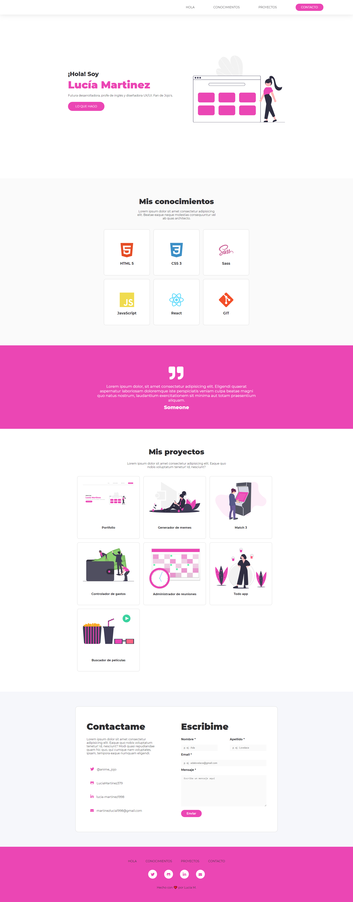

# Proyecto - Portafolio

## Proyecto final para el Primer Módulo del curso de Frontend de Ada ITW. ¡Llegué!
<br>

### Proceso de diseño: Me basé en los colores del favicon, el mismo es el [relic](https://cdn.shopify.com/s/files/1/0441/9405/products/Jojo_Ladybug_Pin_1200x.jpg?v=1546037437) del personaje Giorno Giovanna del anime Jojo's Bizarre Adventure, del cual soy fan. 
### Mi objetivo con este proyecto fue replicar el diseño original del [demo](https://frontend-proyecto-portfolio.adaitw.org/) de Ada lo más parecido posible.
<br>

### [Demo del proyecto en Github Pages](https://luciamartinez379.github.io/Proyecto-portfolio-ada/)
### [Demo del proyecto en Netlify](https://proyecto-portfolio-ada.netlify.app/)

---
---

### Para clonar este repo seguí estos pasos en tu terminal:
<br>

- Ir al [repo](https://github.com/LuciaMartinez379/Proyecto-portfolio-ada).
- Forkearlo.
- Ir a Code y copiar la URL.
- Abrir el bash.
- Ingresar comando ```git clone <url>```.
- Posicionarse en la carpeta del proyecto y abrirlo con un IDE.
<br>
<br>

##### * Este proyecto no necesita de ninguna instalación de dependencias (por ahora 👀).
<br>

---
<br>

### Preview final:

<br>

---
---
<br>

## Este proyecto se hizo gracias al apoyo de [Jonh Parra](https://github.com/jonhks) y [Leydy Moreno](https://github.com/leydyk93/).💜 

## También gracias a las chicas de la 6ta Frontend, la mejor comisión.💪

<br>

---
<br>

### Con 💛 y mucho ☕ para ustedes.